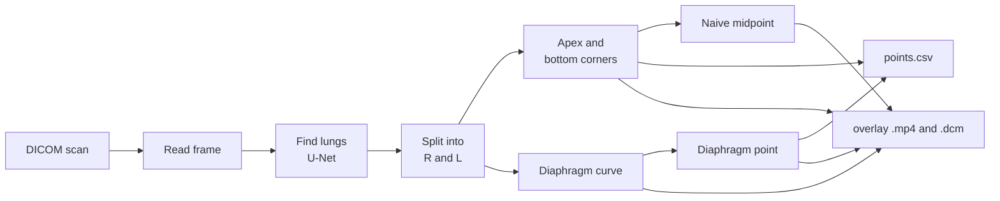

# lungmap

Marks the lungs on every frame of a chest X-ray scan (a DICOM file, `.dcm`):
for each lung, the **apex**, the **diaphragm point** and the two **bottom
corners**. You get a spreadsheet of the points and a video of the scan with
them drawn on. It runs entirely on your computer; scans are never uploaded.

## Set up (Windows, once)

You need Windows 10 or 11 on an Intel or AMD PC, 2 GB of free space, and
internet the first time.

1. **Download:** click the green **Code** button above, then **Download ZIP**.
2. **Unblock:** in your Downloads folder, right-click
   `LungSegmentation-main.zip`, choose **Properties**, tick **Unblock**, and
   click **OK**.<br>
   *Why:* Windows tags downloaded files and warns before running a script
   from them. Unblocking tells it you trust this download.
3. **Unzip:** right-click the ZIP, choose **Extract All...**, pick
   **Documents**, and click **Extract**.
4. **Shortcut:** in the new folder, right-click **Start lungmap (Windows)** and
   choose **Send to > Desktop (create shortcut)**. On Windows 11, click **Show
   more options** first.
5. **First run:** double-click the shortcut. Setup downloads about 1.5 GB and
   takes several minutes. It's ready when it says *Drag a DICOM file or a
   folder into this window*.

## Use it

1. **Drag a scan, or a folder of scans, onto the desktop shortcut.** Or
   double-click the shortcut, drag the scan into the window, and press
   **Enter**.
2. **Wait** about 1 to 3 minutes per scan.
3. **The results folder opens by itself.** Press any key to close the window.

## Your results

They're saved in a `lungmap_output` folder next to the scan. For `chest.dcm`:

| file | open with | shows |
|---|---|---|
| `chest_points.csv` | Excel | one row per frame: the x, y pixel position of each point (blank = not found) |
| `chest_overlay.mp4` | Media Player | the scan with the lungs and points drawn on |
| `chest_overlay.dcm` | a DICOM viewer | the same pictures, filed with the original scan |

**In the pictures:**
- **Lung colors:** amber (**R**) is the lung on the image's left, which is the
  patient's right; blue (**L**) is the other.
- **Points:** a **triangle** marks the apex, and two **squares** joined by a
  dashed line mark the bottom corners.
- **Diaphragm:** the **line along the bottom of the lung**, dashed where its
  hidden dome is estimated. The **filled circle** is the diaphragm point at its
  middle.
- **Simple guess:** the **hollow circle** sits halfway between the corners, for
  comparison.

## If something goes wrong

| you see | do this |
|---|---|
| "Windows protected your PC" | Click **More info**, then **Run anyway**. It appears if step 2 was skipped. |
| The window flashes and closes | Make sure you extracted the ZIP (step 3) and used **Start lungmap (Windows)**. |
| `could not download the model` | Check the internet connection and try again. |
| `could not load TensorFlow` | Install the [Microsoft Visual C++ Redistributable](https://aka.ms/vs/17/release/vc_redist.x64.exe), restart, and try again. |
| `not a readable DICOM file` or `no DICOM files found` | Drag the scan file itself, or the folder that holds the `.dcm` files. |
| An error about the video | Move the scans to a folder with a plain English name, such as `C:\Scans`. |
| Anything else | Send a screenshot of the window to Leo. |

**Starting over:** type `%LOCALAPPDATA%` in File Explorer's address bar and
delete the **lungmap** folder there. The next run sets up again.

## Mac (Apple silicon)

Same steps, but skip Unblock and use **Start lungmap (Mac)**. If macOS blocks it,
open **System Settings > Privacy & Security** and click **Open Anyway**.

## Update or remove

- **Update:** download the ZIP again (steps 1 to 3) and extract it over the old
  folder. Setup is kept.
- **Remove:** delete the folder and the shortcut, then delete these:
  - **lungmap** and **uv** in `%LOCALAPPDATA%`
  - **uv** in `%APPDATA%`
  - **uv.exe** and **uvx.exe** in `%USERPROFILE%\.local\bin`

## How it works

Every frame of the scan goes through the same steps. Each step below names the
file in `lungmap/` that does it.



1. **Get the model** (`model_file.py`). The lung finder is a U-Net, a neural
   network that labels every pixel as lung or not lung. It was trained on the
   Montgomery chest X-ray set, then fine-tuned on 20 DDR scans (see
   [research/](research/README.md)). The first run downloads it (126 MB) and
   checks it against a fixed SHA-256 fingerprint. Later runs reuse the copy.
2. **Read the frame** (`formats/dicom_io.py`: `load_frames`, `to_model_input`).
   - The DICOM's stored left-right flip is applied, so the heart is on the
     image's right as on any front-facing chest film.
   - Brightness is scaled to 0 to 1. Scans stored with white-means-zero
     (MONOCHROME1) are inverted.
3. **Find the lungs** (`segmentation/pipeline.py`: `segment`).
   - The frame is shrunk to 256 × 256, the U-Net's input size, and the model
     predicts each pixel's chance of being lung.
   - That prediction is scaled back to full size *before* being cut at 50%, so
     the lung edge stays smooth instead of blocky.
   - A small morphological "opening" (5 px) removes specks, and only the two
     largest blobs are kept.
4. **Split into two lungs** (`geometry/diaphragm.py`: `split_lungs`). The two
   blobs are sorted by position: the one on the image's left is **R** (the
   patient's right lung), the other is **L**.
5. **Apex and bottom corners** (`geometry/landmarks.py`). Both come from each
   lung's outline.
   - **Apex** (`top_point`): the highest outline point, averaged over its
     topmost pixels so a flat top gives one steady point.
   - **Bottom corners** (`bottom_corners`): the outline points farthest
     down-and-left and down-and-right along 45° diagonals. Diagonals stay
     pinned to the corner, where "lowest point at the far left" would slide
     along a flat diaphragm. These are the angles where the diaphragm meets the
     chest wall and the heart.
6. **Trace the diaphragm** (`geometry/diaphragm.py`: `trace_diaphragm`). Start
   from the lung's lowest pixel in every column and smooth it. Not all of that
   lower edge is diaphragm, so three trims remove the rest:
   - **sudden jumps** (`trim_cliffs`): the steep border of the heart.
   - **too much climb** (`trim_rise`): anything rising more than 20% of the
     lung's height above the lowest point, which is the heart border sloping
     up.
   - **a hook at either end** (`trim_terminal_upturn`): where the edge turns up
     the side chest wall.
   - Finally the trace is clipped to the span between the two bottom corners
     (`trim_to_span`).
7. **Fit the hidden dome** (`fit_dome`). Part of the diaphragm hides behind the
   heart, so a quadratic (a parabola) is fitted through the traced points and
   extended a little past them. It's only kept if it actually curves like a
   dome. On the overlay this is the **dashed** part of the curve; the traced
   part is **solid**.
8. **Diaphragm point** (`center_of`). This is the point on the curve at its
   horizontal middle, the same definition the DDR dataset's ground truth uses.
   The fitted dome is used only when its peak lies over the traced part
   (allowing 15% extra on each side); otherwise the traced curve alone is
   used.
9. **Naive midpoint** (`points.py`: `naive_midpoint`). This is the halfway point
   between the two bottom corners, with no tracing or fitting. It's a simple
   baseline that shows what steps 6 to 8 add. It's drawn on the overlay and
   summarized in the window, but not saved to the CSV.
10. **Write the outputs** (`process.py`, which runs steps 2 to 9 for every
    frame):
    - **CSV** (`points.py`): one row per frame, with the 8 points to 0.1 px.
    - **Pictures** (`rendering/render.py`): the lungs and points drawn on each
      full-size frame.
    - **Video** (`formats/video.py`) and **DICOM** (`formats/dicom_io.py`):
      those pictures saved frame by frame. The DICOM copies the original
      scan's patient, study, pixel size and frame rate.

`cli.py` handles everything around this: which files to read, where to save,
and the messages in the window.

## For developers

### Run it from the code

1. **Install uv** (it fetches the right Python by itself):
   - Mac: `curl -LsSf https://astral.sh/uv/install.sh | sh`
   - Windows (PowerShell): `powershell -ExecutionPolicy ByPass -c "irm https://astral.sh/uv/install.ps1 | iex"`
2. **Get the code:**
   ```bash
   git clone https://github.com/leojqian/LungSegmentation.git
   cd LungSegmentation
   ```
3. **Make a sample** from any chest X-ray DICOM. The first run installs the
   libraries and downloads the model.
   ```bash
   uv run lungmap path/to/scan.dcm -o sample_output --open
   ```

   | option | does |
   |---|---|
   | `path/to/folder` or `"*.dcm"` | process every DICOM in a folder, or every match |
   | `-o DIR` | output folder (default: `lungmap_output` next to each scan) |
   | `--open` | open the output folder when done |
   | `--model PATH` | use a specific weights file instead of the downloaded one |

4. **Run the tests** (about 15 seconds; no model or data needed). Expect
   `238 passed`.
   ```bash
   uv run --extra dev pytest
   ```
5. **Check accuracy against ground truth.** This needs the DDR data in
   `SampleDDR_August2026/` and both model files; see
   [research/README.md](research/README.md). It overwrites
   `outputs/ddr_eval/`.
   ```bash
   uv run --extra research python research/ddr/step07_evaluate.py
   ```
   Expect Dice 0.980 and a diaphragm-point error of 10.66 ± 13.27 mm (right)
   and 37.41 ± 11.37 mm (left).

`pip install .` also works and installs only `lungmap/`, on Python 3.11 to 3.13
(Windows x86-64 or Apple-silicon Mac). The model is taken from `--model`, then
`$LUNGMAP_MODEL`, then `./best_model_ddr_finetuned_phase3.h5`, then a previous
download. If none of those exist, it's downloaded from the `model-v1` release
and its checksum is verified.

### The CSV columns

`frame`, then x and y for each point: `R_apex_x, R_apex_y, R_diaphragm_x,
R_diaphragm_y, R_lower_left_x, ..., L_lower_right_y` (17 columns). `R` is the
image-left lung. Coordinates are in the scan's pixel grid after its stored
left-right flip is applied, the same grid as the overlay files. The diaphragm
point is the horizontal center of the traced diaphragm curve, the DDR
dataset's own definition.

### What's in this repository

| path | what it is | in the package? |
|---|---|---|
| `Start lungmap (Windows).bat`, `Start lungmap (Mac).command` | double-click launchers | runs it |
| `lungmap/` | **the lungmap package**: everything the tool runs | **yes** |
| `tests/` | tests for `lungmap/` | no |
| `research/` | the scripts that trained and evaluated the model ([research/README.md](research/README.md)) | no |
| `docs/design/` | design notes behind the algorithm and the fine-tuning | no |

Inside `lungmap/`:

| module | job |
|---|---|
| `cli.py` | the `lungmap` command: inputs, outputs, messages |
| `process.py` | one DICOM → points CSV + overlay DICOM + MP4 |
| `points.py` | the 8 output points, the naive midpoint, the CSV layout |
| `model_file.py` | find, download (first run) and load the U-Net weights |
| `segmentation/pipeline.py` | image → lung masks → measurements |
| `geometry/` | lung mask → diaphragm curve (`diaphragm.py`), apex and corners (`landmarks.py`) |
| `formats/` | read and write DICOM (`dicom_io.py`); write MP4 (`video.py`) |
| `rendering/render.py` | drawing the overlays |

### Limits

Upright, front-facing (PA) chest films only. The model was fine-tuned on 20 DDR
cases, so treat the points as a research measurement, not a clinical one.
